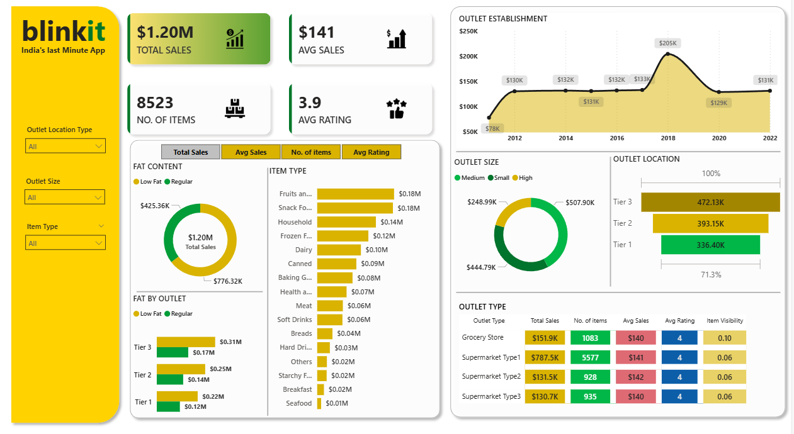

📊 Blinkit Sales Dashboard (Power BI)

🔹 Overview
In this project, I analyzed Blinkit sales data using Power BI to uncover meaningful insights that can help improve business decisions. The dashboard provides a clear view of sales performance, customer behavior, and product trends.

🔹 Business Objective
The goal of this project was to understand how different factors like product categories, customer purchases, and time trends impact overall sales, and to identify opportunities to improve revenue and efficiency.

🔹 Key Insights
- Identified overall sales trends and revenue patterns  
- Analyzed category-wise performance to find top contributors  
- Highlighted top-selling products  
- Tracked monthly sales trends for better forecasting  
- Explored customer purchase behavior  

🔹 Tools & Technologies
- Power BI  
- DAX (Data Analysis Expressions)  
- Power Query (Data Cleaning & Transformation)  
- Data Modeling  

🔹 Dashboard Preview

🔹 Key Metrics (KPIs)
- Total Sales  
- Total Orders  
- Average Order Value  
- Category-wise Revenue  

🔹 Project Files
- `Blinkit Dashboard.pbix` → Main Power BI dashboard file  
- `dashboard.png` → Preview of the dashboard  

🔹 What I Learned
- How to build interactive and user-friendly dashboards  
- Writing DAX measures for business calculations  
- Cleaning and transforming raw data using Power Query  
- Presenting data insights in a clear and visual way  

🔹 Author
**Pranjal Jadhav**
